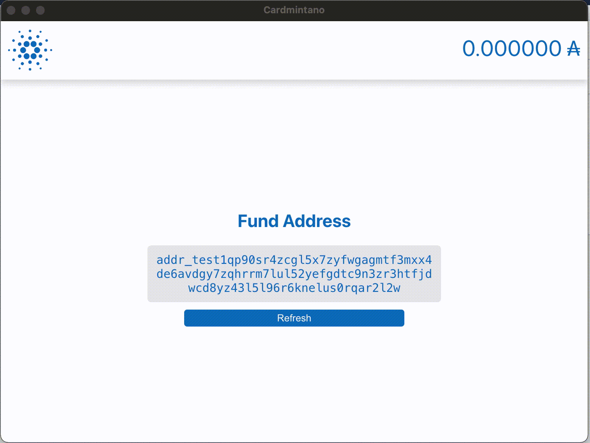

# Cardmintano

A graphical user interface for minting native tokens on Cardano network, built with Electron and React.

This is only a learning project and as such it is not recommended to be used for anything production related, so please use at your own risk. With that out of the way, you can find pre-built executables on the [releases](https://github.com/ElGatoLoco/cardmintano/releases) page.

## How it works?

In order to simplify usage and avoid having to build your own node, the app relies on having Daedalus wallet running. Everything that is entered through the UI is being used as payload for cli commands that are run in the background.

### Limitations

- The app is currently working only on testnet and MacOS
- When the app is started for the first time, a new address is created which you need to fund in order to be able to mint tokens
- Current functionality is very basic - only options you get to enter through the UI are token name and token amount
- Every minted token uses the same policy which is created when the app is started for the first time

### TODO

- Add support for mainnet
- Add support for other operating systems beside MacOS
- Add support for multiple addresses
- Add ability to transfer ADA and native tokens to different addresses
- Add support for running your own node
- Add support for custom policies
- Add metadata support

## Available Scripts

For the full list of available scripts checkout [package.json](package.json)

### `yarn start`

Runs the app in the development mode.

### `yarn build`

Builds the app for production to the `release` folder.\
It correctly bundles React in production mode and packages it to Electron executable.

## Learn More

You can learn more about Cardano [here](https://docs.cardano.org/en/latest/).
